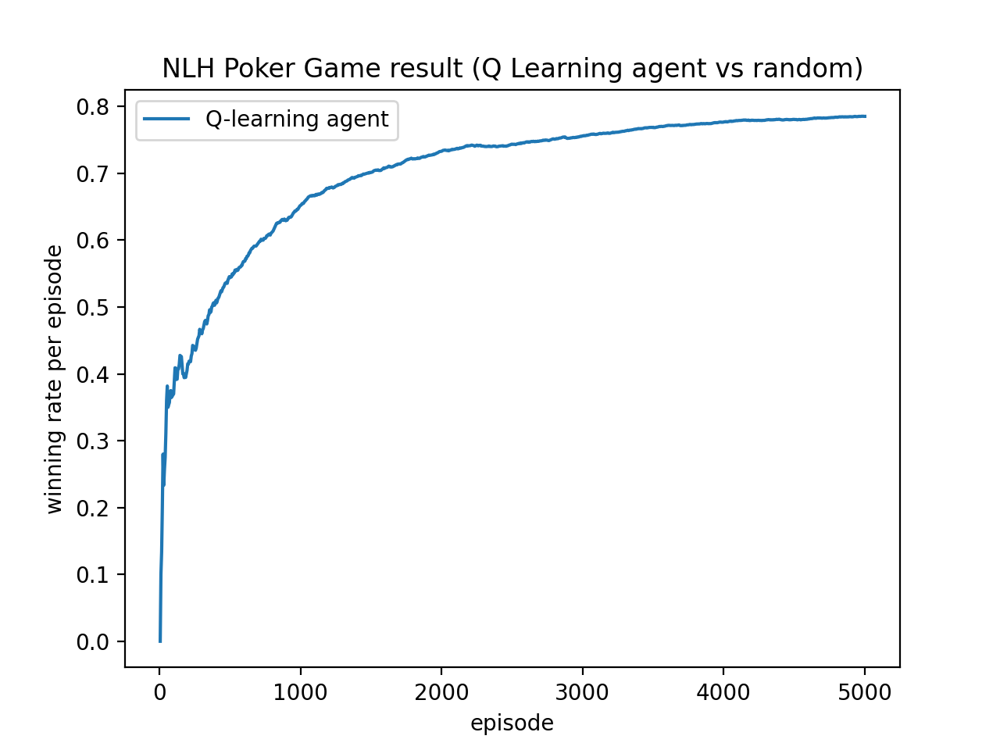

# NLH Poker AI Reinforcement agents
## Agent list:
+ Q-Learning Agent
+ Random Player (from PyPokerEngine)

## Train Result

@Para: gamma=0.9, epsilon=0.1, learning_rate=0.05, num of simulation=100
## Preliminaries
```sh
pip install PyPokerEngine
```
## Run
```sh
# Train model
python train.py

# Test a model or just play a game
python test.py
```
## Coming features
### Training features
+ multi-processing to increase training spped
+ parse argument from command line or yaml
### More Models
+ sarsa
+ a2c
+ a3c
+ multi-agent
---

### 名詞解釋 (這裡 refactor會影響到 interface暫時先不更改)
1. 局(**Episode**): 一局遊戲是指參賽的2名玩家進入一張遊戲桌, 持有相等的初始籌碼, 對戰直到本遊戲桌只剩下 不多於半數 玩家勝出, 而其餘玩家因籌碼耗盡而出局為止, 一局由多圈構成
2. 圈(): 一圈是指 dealer button 圍繞牌桌在每個未出局的玩家手上都出現一次為止為一圈,一圈由多輪構成,在一圈過程中大小盲注數額相等,但是下一圈開始時大小盲注翻倍
3. 輪(**CYCLE**): 一輪遊戲是指每次荷官重新發公共牌和私有牌, 每個玩家按回合進行決策, 直到除了一名玩家之外全部棄牌, 或者5張公共牌完全翻開為止, 決出本輪勝負並清算籌碼, 一輪由多個回合構成
4. 回合(**ROUND**): 一回合是指所有玩家依次take action, 稱為一回合, 一個回合中有多個(分別來自各個玩家的)action
5. action(**STEP**): 一個action是指輪到某一個玩家 call/raise/check/fold/~~bet~~/~~allin~~ 玩家通過 AI 客戶端完成其中一種決策稱之為一個action
6. 大盲（Big blind), 小盲(Small blind)：每一个cycle开始前会指定大盲小盲，且金额会随游戏局数增加而增加
7. 公共牌池（community_cards）: 長度為 5的 list, 每一個 item唯一張卡

**PyPokerEngine里面出现的Round实际上为Cycle**
## Action介紹

agent要做出下列一個 action由下列两个部分组成：：
+ `action`: 
    + `CHECK` 歲月靜好 (不下注)
    + `CALL` 跟 (下注, 但不指定金額)
    + `RAISE` 提高開殺 (下注, 指定親俄)
    + `FOLD` 放棄 GG (不下注放棄)
+ `amount`: 當`action`為 `RAISE` 或者`CALL`時, 此项代表下注的金额

## Acknowledgement
This project is based on [PyPokerEngine](https://github.com/ishikota/PyPokerEngine), detailed docs on env could be found at its [doc site](https://ishikota.github.io/PyPokerEngine/).
