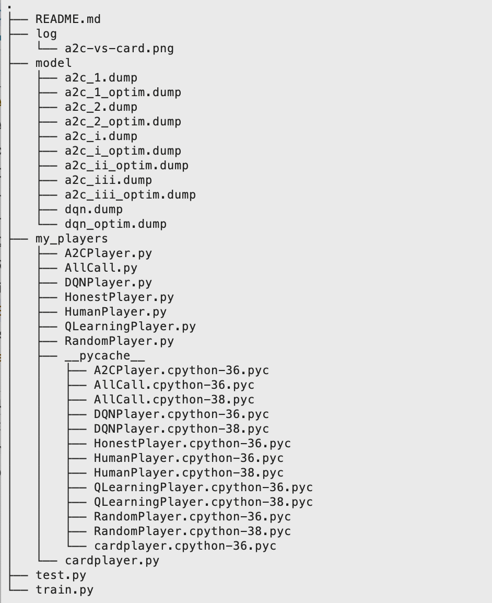
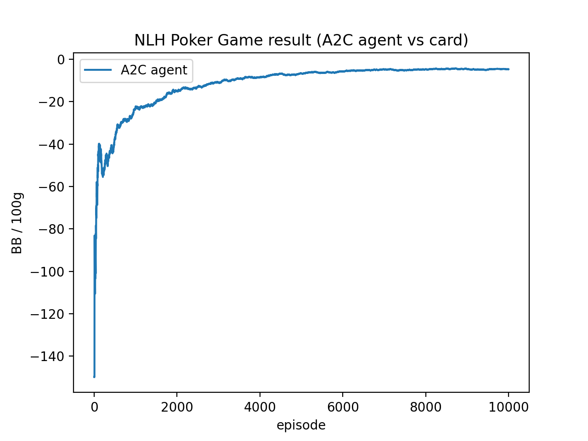

# NLH Poker AI Reinforcement agents
## Preliminaries
```sh
# Game environment
pip install PyPokerEngine
# Deep Learning
pip install pytorch
# Process the result
pip install scipy
```
## Run
```sh
# Train model
python train.py

# Test a model or just play a game
python test.py
```
## Agent list:
+ A2C Player
+ DQN Player
+ Q-Learning Agent
+ Card Player
+ Honest Player
+ Random Player
+ AllCall Player
+ Human Player

## Directory Structuer


## Train Example
An example figure oczraining process.

## best configuration
+ LR=1e-4
+ gamma=0.95
+ Neural Network: 8->128->8, relu
+ Reward: No everage, /150

## Acknowledgement
This project is based on [PyPokerEngine](https://github.com/ishikota/PyPokerEngine), detailed docs on env could be found at its [doc site](https://ishikota.github.io/PyPokerEngine/).
